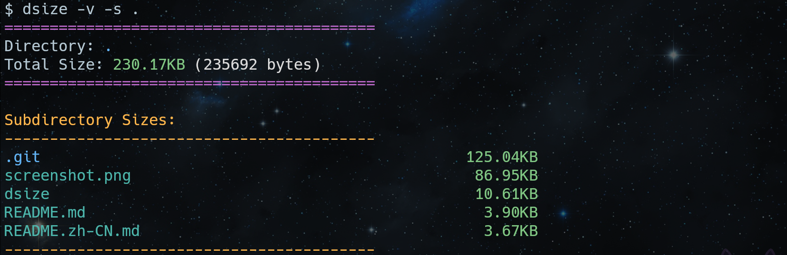

# dsize

[English](https://www.zdoc.app/en/Youpen-y/dsize)

`dsize` 是一个简易的Bash 脚本工具，用于以美观、易读的格式显示文件和目录的大小。相比于传统的 `du` 命令，它提供了更好的视觉反馈、颜色区分以及对中文字符对齐的优化支持。



---

## ✨ 核心特性

* **人类可读的格式**：自动将字节转换为 B，K，M，G，T 等单位，并根据大小级别显示不同颜色（如绿色表示 KB，黄色表示 MB，红色表示 GB/TB）。
* **智能对齐**：针对终端显示进行了优化。如果系统中安装了 Python 3，脚本将精确计算中文字符宽度，确保文件名与大小数据严格对齐。
* **深层查看**：支持展示目录下的子项大小（嵌套深度为1），方便快速定位空间占用。
* **排序功能**：支持按文件大小进行降序排列（`--sort`），让“空间杀手”一目了然。
* **符号链接支持**：自动解析软链接（Symbolic Link），显示链接指向的真实路径及其目标的大小。
* **色彩开关**：支持 `-c` 选项禁用颜色输出，方便在自动化脚本或导出日志时使用。

---

## 🚀 安装指南

1.  **保存脚本**：下载 `dsize` 的文件。
2.  **赋予执行权限**：
    ```bash
    chmod +x dsize
    ```
3.  **移动到系统路径（可选）**：
    为了方便在任何目录下使用，建议将其移动到 `/usr/local/bin`：
    ```bash
    sudo mv dsize /usr/local/bin/
    ```

---

## 📖 使用方法

### 命令格式
```bash
dsize [选项] <路径>
```

### 常用选项
| 选项	| 长选项	| 描述 |
|---|---|---|
|`-d`	| `--detail`	| 显示子目录/文件大小（不含隐藏文件）|
|`-v`	|`--verbose`	| 显示所有子目录/文件（包含隐藏文件）|
|`-s`	|`--sort`	| 按大小降序排列（需配合 `-d` 或 `-v` 使用）|
|`-c`	|`--no-color`	| 禁用彩色输出 |
|`-h`	|`--help`	| 显示帮助信息 |


### 示例演示
- 查看当前目录总大小：
```bash
dsize .
```

- 查看子目录详情并排序：
```bash
dsize -d -s /var/log
```

- 包含隐藏文件查看用户家目录：
```bash
dsize -v ~
```

- 查看单个文件信息：
```bash
dsize file.txt
```

## 🛠 依赖要求
- Bash: 脚本运行的核心环境。

- awk: 用于精确的浮点数计算。

- Python 3 (可选): 用于处理 CJK（中日韩）字符的对齐。如果未安装，脚本将退回到基于字节数的估算对齐。

---
## 📄 许可证
本项目采用 MIT 许可证

---
## 🤝 贡献者
- Yang Yupeng (yongy2022@outlook.com) - 作者

- ChatGPT (OpenAI) - 辅助开发与逻辑优化

- Claude (Anthropic) - 辅助开发与逻辑优化