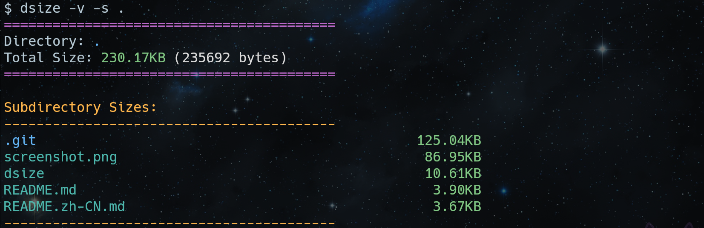

# dsize

**[English](README.md) | [中文](README.zh-CN.md)**

`dsize` is a simple Bash script tool that displays file and directory sizes in a beautiful, human-readable format. Compared to the traditional `du` command, it provides better visual feedback, color differentiation, and optimized support for Chinese character alignment.



---

## ✨ Key Features

* **Human-readable format**: Automatically converts bytes to B, K, M, G, T units, with color coding based on size levels (green for KB, yellow for MB, red for GB/TB).
* **Smart alignment**: Optimized for terminal display. If Python 3 is installed on the system, the script will precisely calculate Chinese character widths to ensure filenames and size data are strictly aligned.
* **Deep view**: Supports displaying the size of sub-items within a directory (nesting depth of 1), making it easy to quickly locate space usage.
* **Sorting**: Supports sorting by file size in descending order (`--sort`) to easily identify "space hogs".
* **Symbolic link support**: Automatically resolves symbolic links and displays the real path.
* **Color toggle**: Supports the `-c` option to disable color output for use in automated scripts or log exports.

---

## 🚀 Installation Guide

1. **Save the script**: Download the `dsize` file.
2. **Grant execute permissions**:
    ```bash
    chmod +x dsize
    ```
3. **Move to system path (optional)**:
    To use it conveniently from any directory, it's recommended to move it to `/usr/local/bin`:
    ```bash
    sudo mv dsize /usr/local/bin/
    ```

---

## 🆚 Why dsize over du?

`dsize` is essentially an enhanced wrapper around `du` that addresses common pain points:

| Feature | `du` command | `dsize` |
|---------|--------------|---------|
| **Human-readable output** | Needs `-h` flag, breaks sorting | Always human-readable, correct sorting |
| **Color coding** | No | Size-based colors (green/yellow/red) |
| **CJK alignment** | Misaligned filenames | Smart width calculation |
| **Symbolic links** | Shows link itself | Resolves and displays real path |
| **Sorting** | Requires pipe to sort | Built-in `-s` flag |
| **Visual appeal** | Raw numbers | Beautiful framed output |
| **Memory efficiency** | — | Streaming processing for large dirs |

### Color Coding Guide

| Size Range | Color | Meaning |
|------------|-------|---------|
| B (Bytes) | White | Tiny files |
| KB | Green | Small files |
| MB | Yellow | Medium files |
| GB/TB | Red | Large files - attention needed |

---

## 📖 Usage

### Command Format
```bash
dsize [OPTIONS] <PATH>
```

### Common Options
| Option | Long Option | Description |
|---|---|---|
| `-d` | `--detail` | Show subdirectory/file sizes (excluding hidden files) |
| `-v` | `--verbose` | Show all subdirectories/files (including hidden files) |
| `-s` | `--sort` | Sort by size in descending order (use with `-d` or `-v`) |
| `-c` | `--no-color` | Disable colored output |
| `-h` | `--help` | Display help information |

### Examples
- View current directory total size:
```bash
dsize .
```

- View subdirectory details with sorting:
```bash
dsize -d -s /var/log
```

- View user home directory including hidden files:
```bash
dsize -v ~
```

- View single file information:
```bash
dsize file.txt
```

## 🛠 Requirements
- **Bash**: Core environment for script execution.
- **awk**: Used for precise floating-point calculations.
- **Python 3** (optional): Used for handling CJK (Chinese, Japanese, Korean) character alignment. If not installed, the script will fall back to byte-based estimation alignment.

---

## 📄 License
MIT License.

---

## 🤝 Contributors
- **Yang Yupeng** (yongy2022@outlook.com) - Author
- **GLM** (ZAI) - Assisted with development and logic optimization
- **ChatGPT** (OpenAI) - Assisted with development and logic optimization
- **Claude** (Anthropic) - Assisted with development and logic optimization

